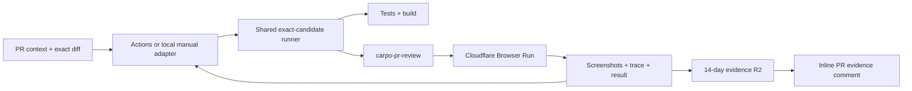

# Carpo PR Browser Review Harness

**Status:** exact-candidate CI and local/manual runs green; inline R2 evidence verified, 2026-08-26
**Branch:** `infra/cloudflare-release-reviewer`

Current checkpoint: PR #8 produced the first green end-to-end CI run, then the backend-neutral manual adapter completed a second exact-candidate run during a GitHub Actions outage. The manual execution passed all repository checks and 17 Browser Run assertions, held one Worker version fixed, uploaded three `1440×1000` PNGs plus a manifest to `carpo-pr-review-evidence`, and created [the inline evidence comment](https://github.com/dayhaysoos/carpo/pull/8#issuecomment-5428391133). Direct reads returned `200 image/png`, the remote and local manifest SHA-256 values matched, and GitHub rendered all three images through its image proxy. The bucket has a 14-day expiration lifecycle.

## The simple version

When a pull request is opened or updated, GitHub Actions normally invokes the runner. A developer can invoke the same runner directly with `npm run review:pr -- --pr <number>` when Actions is unavailable:

1. The thin trigger adapter freezes the PR's base and head SHAs, checks out that exact head, and verifies that the live PR still names both commits. The manual adapter creates a temporary detached worktree so ambient local changes cannot enter the candidate.
2. It snapshots the PR title, body, comments, commits, an exact PR-style merge-base-to-head `git diff` and changed-file list derived from the frozen base/head pair, and up to 20 linked closing issues with up to 50 comments per issue.
3. A hardcoded allowlist proves every mutable Cloudflare binding still names the isolated review resources, migration-changing candidates are rejected before mutation, and the normal test and build commands run.
4. The candidate is deployed to one isolated Cloudflare environment named `pr-review`, with the exact head SHA attached as its Worker version tag.
5. A Cloudflare Browser Run session authenticates to that deployment, proves the observed Worker tag matches the expected head SHA, performs bounded browser checks selected from Carpo's permanent smoke tests plus known diff and PR/Issue context signals, proves the Worker version ID did not change during traversal, and records screenshots plus a credential-audited Playwright trace.
6. PNG screenshots are written under an immutable PR/SHA/run-specific prefix in the dedicated evidence R2 bucket. The review Worker exposes only those tightly validated PNG paths, while the application and clip buckets remain private.
7. The active GitHub reporting identity creates or updates its marker-based PR comment with the exact reviewed SHA, assertion and diagnostic counts, inline screenshots, execution-source link, retention, and proof boundary. Actions also retains the trace and frozen evidence as an artifact; a manual run keeps them in its local output directory. The R2 manifest is uploaded before comment publication, so a GitHub reporting failure does not discard the evidence.

That is v0. It is intentionally not a general autonomous QA platform.

## Why one shared review environment

Carpo is a full-stack Worker with D1, R2, Durable Objects, Agents SDK routes, and a Container. Cloudflare preview URLs are not available for Workers that implement Durable Objects or Containers, so a static preview would not exercise the actual product boundary.

Creating a separate D1 database, R2 bucket, Durable Object namespace, and Container application for every PR would add provisioning and cleanup machinery before the browser checks have proved useful. V0 therefore uses:

- one Worker: `carpo-pr-review`;
- one review-only D1 database: `carpo-pr-review`;
- one review-only R2 bucket: `carpo-clips-pr-review`;
- one evidence-only R2 bucket: `carpo-pr-review-evidence`, with a 14-day lifecycle and no production binding;
- environment-specific Durable Objects and Container configuration;
- a review-only Worker secret that protects the browser-facing static and dynamic application surface with an HttpOnly cookie during browser review; Container callbacks remain separately protected by their existing per-job secrets;
- an explicit non-secret review-mode marker and `routes: []`, so an accidentally provisioned production secret cannot activate the gate and future production routes cannot be inherited by review;
- GitHub concurrency that permits only one review candidate at a time and cancels a superseded run.

No review binding points at production data. If concurrent PR review later becomes a real bottleneck, that is the trigger to consider per-PR stacks.

The shared D1 database and Durable Object namespaces are deliberately persistent, so v0 refuses any PR whose exact, rename-unfolded changed-file list touches `migrations/` or whose top-level Wrangler Durable Object migration array differs from the frozen base commit. Applying a rejected candidate's state migration would contaminate every later review and make evidence candidate-inexact. Migration work therefore requires an isolated/recreated review environment before this workflow may test it.

## What PR context and the diff do

The harness uses three inputs with different authority:

| Input | Purpose |
| --- | --- |
| Permanent Carpo smoke checks | Always verify that the Create and Library surfaces render and their read-only requests settle cleanly. |
| PR/Issue context | Explain the intended change, preserve requirement context, and add only repository-catalogued checks through a bounded keyword map. |
| Exact PR merge-base-to-head diff | Select relevant known surfaces from a small repository-owned path map. |

PR bodies, issue text, comments, commit messages, and diff contents are untrusted data. V0 never executes instructions found in them, invents selectors from them, or lets them change credentials, URLs, or pass/fail rules. Text and changed paths can only select from a small repository-owned case catalog. The exact context and diff are hashed into the result so the evidence can be matched to what was reviewed.

The first selector is deliberately small. Create and Library always run; known library/source-video paths or archive/library language in the frozen PR and linked-issue context add the archived-library surface. Each selected surface records its reason. We should extend this map only when a real change demonstrates a useful deterministic check.

## What v0 proves

The initial browser review is read-only. It first calls an authenticated identity route backed by Cloudflare's Worker version-metadata binding and refuses to continue unless its version tag equals the event's exact head SHA. After the surface checks it calls the route again and requires the same version ID, preventing a shared-environment replacement from producing mixed-version evidence. It then proves that candidate:

- renders the Carpo shell and Create surface;
- keeps the owned-video upload mode selected by default;
- keeps the best-effort YouTube source entry point visible without treating external download reliability as a release gate;
- keeps manual title and caption editing visible;
- prevents an incomplete clip submission;
- renders the Library and, when selected by the diff, bounded PR/issue context, or a manual run without changed-path context, Archived views;
- settles their read-only API requests without a visible error;
- produces no same-origin request failures, server errors, uncaught page errors, or console errors during those checks.

It captures and publishes:

- `create.png`, `library.png`, and `archived.png` when that diff-, context-, or manual-run-selected surface runs;
- `failure.png` when a browser step fails;
- `trace.zip`, with network/DOM snapshots disabled and the finished archive rejected if it contains the review credential;
- `context.json` and `diff.patch`;
- `changed-files.json`, derived from the same frozen PR merge-base/head comparison;
- `test-plan.json`, including context and diff digests;
- `result.json` and a human-readable `summary.md`.
- immutable R2 PNG keys of the form `pull-requests/<pr>/<sha>/executions/<execution-id>/<surface>.png`;
- one marker-based PR comment per GitHub reporting identity, updated by later runs from that same adapter identity.

The artifact is evidence, not a blanket certification. V0 does not yet prove upload, encoding, clip playback, YouTube reliability, production behavior, accessibility, visual quality, or unknown exploratory behavior.

## What is deliberately deferred

Do not add these until the basic loop has run successfully on real PRs:

- a separate verifier Worker;
- Cloudflare Workflows orchestration;
- an evidence dashboard beyond the single PR comment;
- per-PR infrastructure stacks;
- an LLM-authored test plan or LLM release verdict;
- Stagehand, WebMCP, or an Agents SDK reviewer;
- managed Cloudflare Access identity in front of the review URL (v0 already uses a scoped review-secret cookie gate);
- automatic merge, promotion, rollback, or production deployment;
- browser/device matrices;
- extensive cleanup or fixture systems.

Each is a possible upgrade, not a prerequisite.

## Small-step rollout

### Checkpoint 0 — configuration

- Add the review-only Wrangler environment and resources.
- Add the GitHub workflow, browser runner, and evidence artifact.
- Validate the Wrangler configuration and ordinary repository checks.

**Exit:** no production binding is referenced, and every component can be exercised manually from the branch.

### Checkpoint 1 — deployed shell proof

- Apply review D1 migrations.
- Deploy the exact branch candidate to `carpo-pr-review`.
- Run the browser reviewer locally through Cloudflare Browser Run.
- Inspect all screenshots, the trace, diagnostics, and proof-boundary text.

**Exit:** a repeatable local invocation passes against the isolated deployed stack.

### Checkpoint 2 — automatic PR proof

- [x] Add a least-privilege `CLOUDFLARE_API_TOKEN` Actions secret.
- [x] Add `CLOUDFLARE_ACCOUNT_ID` and `CARPO_PR_REVIEW_URL` Actions variables.
- [x] Open or update a test PR and verify the GitHub summary and downloadable evidence artifact.
- [x] Verify the dedicated R2 upload, private manifest, and inline screenshot comment through the manual PR adapter.
- [ ] Intentionally break one stable assertion and confirm the check fails with useful evidence.

**Exit:** both a known-good and known-bad PR produce trustworthy results without manual browser operation.

### Checkpoint 3 — owned-upload golden path

- Add a tiny repository-owned or review-bucket MP4 fixture with a fixed digest.
- Upload it through the visible UI.
- Exercise trim, title, caption, and quality controls, preserving manual edits.
- Create, wait for real Container encoding, play the result, and reopen it from Library.
- Clean up only records and objects created by that run.

**Exit:** Carpo's primary owned-video journey becomes the deterministic release gate.

### Checkpoint 4 — bounded exploratory review

- Feed the frozen PR context and diff to a browser agent only after deterministic checks pass.
- Restrict it to the review origin, safe actions, a time/step budget, and no destructive or external actions.
- Keep exploratory findings advisory and convert valuable recurring findings into deterministic cases.

**Exit:** the agent broadens inspection without becoming the release oracle.

## Upgrade triggers

Add complexity only in response to evidence:

| Observed need | Smallest next upgrade |
| --- | --- |
| PRs regularly wait on the shared environment | Per-PR resources or explicit application-level test tenancy |
| A PR changes D1 or Durable Object migrations | Recreated or per-candidate state resources before running that candidate |
| CI/browser interruptions create unreliable retries | Cloudflare Workflow around the existing steps |
| Fourteen-day PR evidence is insufficient for retention/search | Extend the R2 lifecycle or add an evidence index/dashboard |
| Deterministic coverage misses important change-specific behavior | Bounded Stagehand/agent exploration after the gate |
| Review access needs user identity, revocation, or audit policy | Replace the scoped v0 secret-cookie gate with Cloudflare Access and service-token authentication |
| Reviewers need semantic app tools | Evaluate WebMCP after the browser loop is stable |

## Credentials and authority

Local Wrangler OAuth and the authenticated GitHub CLI are sufficient for the manual PR adapter; GitHub Actions is optional. When no local `CARPO_PR_REVIEW_AUTH_TOKEN` is supplied, the manual adapter generates a fresh high-entropy value, writes it to the isolated review Worker, and synchronizes the optional Actions secret without printing or storing the value in the repository. GitHub is otherwise used only to obtain PR/Issue context and publish the requested PR report. Unattended CI needs a least-privilege Cloudflare API token stored as `CLOUDFLARE_API_TOKEN`, the synchronized review token, plus the account ID and fixed review URL as repository variables. The Worker fails closed when the allowlisted review-mode marker is enabled but the required secret is absent; without that marker, production ignores the review secret even if it is accidentally provisioned there. The browser places the review token only in a Secure, HttpOnly, same-origin cookie; it does not install a global request header that could be sent to external media origins.

Cloudflare's current guidance starts with the **Edit Cloudflare Workers** custom token template and recommends scoping it to the single account. This harness also needs **Browser Rendering: Edit** for the CDP session; its D1, R2, and Container operations must be covered by the resulting token permissions. Store the token only in GitHub Actions, never in the repository.

The workflow has read-only repository and issue permissions plus `pull-requests: write`, which is used only to create or update the marker-based evidence comment. It runs only for owner-authored branches inside this repository. The Cloudflare credential is exposed only to migration, deployment, Browser Run, and evidence-upload steps; the application review token is exposed only to validation and Browser Run. The workflow rechecks both live PR refs immediately before deploy and after browser review. If either ref moves or the final lookup cannot verify them, it rewrites any in-run PASS result as stale/failed before summary, comment, and artifact publication, so a superseded or unverifiable candidate cannot produce trusted green evidence. It contains no merge, push, production-deploy, or deletion command; its API token should still be restricted as narrowly as Cloudflare permits. A green result remains advisory until Checkpoint 2 has demonstrated a useful failure on a deliberately broken candidate.

## Current acceptance boundary

V0 is ready when:

- the review Worker deploys with review-only D1/R2/DO/Container bindings;
- the resolved review configuration exactly matches the hardcoded review-resource allowlist and explicitly rejects production identities;
- D1- or Durable Object-migration-changing PRs fail before any review state mutation;
- the browser-facing review surface rejects a request without the review-only credential, while the exact Container callback routes retain per-job authentication;
- all D1 migrations apply to the review database;
- normal tests, typechecking, and build pass;
- a Cloudflare Browser Run session proves the exact tagged Worker version and produces the expected screenshots, trace, clean diagnostics, and passing result against the deployed review URL;
- the screenshots are publicly readable only through allowlisted immutable review-evidence paths, expire from the dedicated R2 bucket after 14 days, and render inline in one updateable PR comment;
- the GitHub workflow syntax is valid;
- the remaining one-time CI credential step is stated plainly if it cannot be completed automatically.

The next meaningful feature after that is the owned-upload golden path—not a larger orchestration system.

## Cloudflare references

- [GitHub Actions authentication for Workers](https://developers.cloudflare.com/workers/ci-cd/external-cicd/github-actions/)
- [Browser Run with Playwright over CDP](https://developers.cloudflare.com/browser-run/cdp/playwright/)
- [Browser Run session management](https://developers.cloudflare.com/browser-run/cdp/session-management/)
- [Workers Builds and Container deployment behavior](https://developers.cloudflare.com/workers/ci-cd/builds/configuration/)
- [Wrangler environments](https://developers.cloudflare.com/workers/wrangler/environments/)
