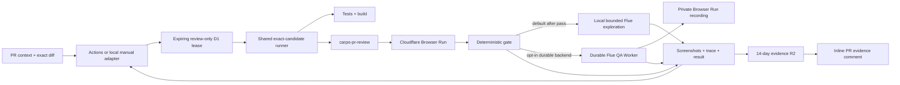

# Carpo PR Browser Review Harness

**Status:** exact-candidate deterministic harness green; local bounded Flue adapter now includes a live WebMCP evaluation path; durable Cloudflare-native Flue service remains a separate optional backend, 2026-08-28
**Branch:** `feature/webmcp-clip-proposals`

Current checkpoint: PR #8 produced the first green end-to-end CI run, then the backend-neutral manual adapter completed a second exact-candidate run during a GitHub Actions outage. The manual execution passed all repository checks and 17 Browser Run assertions, held one Worker version fixed, uploaded three `1440×1000` PNGs plus a manifest to `carpo-pr-review-evidence`, and created [the inline evidence comment](https://github.com/dayhaysoos/carpo/pull/8#issuecomment-5428391133). Direct reads returned `200 image/png`, the remote and local manifest SHA-256 values matched, and GitHub rendered all three images through its image proxy. The bucket has a 14-day expiration lifecycle.

The next slice now runs by default after the deterministic exact-head checks pass. `--no-agentic` (or `CARPO_PR_REVIEW_AGENTIC=false`) is the explicit emergency/cost escape hatch. A backend-neutral Flue agent reads bounded chunks of the same frozen context and diff, then chooses safe browser actions against the same exact tagged review Worker. The host serializes its tools, pins one origin and Worker version, rejects duplicate screenshots, strips and downgrades unsupported coverage claims to `inconclusive`, and requires Create and Library evidence, browser diagnostics, explicit remaining risks, and a structured finish. The latest working-tree smoke used Cloudflare Workers AI through local Wrangler OAuth, completed 20 bounded tool calls against exact version tag `flue-smoke-20260827T045743Z`, captured three distinct `1440×1000` PNGs for Archived, Library, and Create, and recorded zero browser diagnostics or blocked mutations. That proves the adapter works; it is not committed-PR proof and does not add upload/encoding coverage.

The implementation now also includes an opt-in durable backend in [`review-service/`](../../review-service). It deploys separately from candidate code, runs Flue inside a generated SQLite-backed Durable Object, uses the Worker AI binding, and creates recorded Browser Run sessions. Its browser capabilities remain narrow host-authored tools—read frozen material, inspect, navigate a positive route catalog, select desktop/mobile viewports, click safe links/tabs, fill safe text fields, capture private screenshots, and read diagnostics. It does **not** expose Flue Code Mode, arbitrary CDP source, a shell, or general network tools to the model. Reports and screenshots are stored in the dedicated evidence R2 bucket and available through an authenticated dossier with rrweb replay. Flue tracing is installed with `content: false`, so Workers traces preserve operational spans without prompts, diffs, tool arguments, or page content. The default local backend now also explicitly creates its Browser Run session with recording enabled, closes the exact session after the review, waits for finalization, and retains `browser-recording.json` in the local or Actions execution output. That artifact is structured rrweb replay data rather than an MP4; Cloudflare masks input values and does not capture actual `<video>` or `<audio>` playback.

Both execution backends now import the same provider-neutral [`review-contract/`](../../review-contract) workspace. It owns the unchanged v1 schemas and every rule whose drift could change reviewer authority or proof quality: route and action safety, proof challenges, completion and evidence validation, coverage downgrades, diagnostics verdicts, and shared instruction facts. Local Playwright/Workers AI and Durable Browser Run/Flue remain thin integration adapters around that contract.

The default local backend now starts its agentic Browser Run in Cloudflare's lab pool and mounts a bounded WebMCP bridge. A tiny non-production media seed is provisioned once at `review-fixtures/webmcp/source.mp4` in the isolated review clip bucket; each run installs and later removes only its disposable uploaded-video row and transcript. Flue must discover `getCarpoInstructions`, `readClipWorkspace`, and `proposeClips` in the live page and call them successfully in that order. The host restricts the transcript window, requires the exact returned video/revision/block identities, permits exactly one reversible proposal, verifies the human-review modal is visible, performs a read-only check that zero fixture clips were persisted, captures screenshot evidence, and removes the disposable fixture data even when the agent is inconclusive. The PR comment reports this deterministic WebMCP proof separately from Flue's qualitative strengths, frictions, and recommendations. The model never receives arbitrary JavaScript execution.

This branch also carries one repository-owned committed-PR proof challenge. The exact changed path `review-challenges/multilingual-octopus.json` selects a hardcoded host task: replace the Create Title with `octopus`, then Spanish `pulpo`, French `pieuvre`, and Japanese `タコ`, capturing each visible state without submitting. The runner ignores the marker's contents and all PR prose when selecting or defining the task. The browser host independently enforces the Title field, Create route, exact values, order, and immediate screenshot sequence. Because selection depends on this path appearing in the frozen base/head diff, the challenge does not run on ordinary later PRs after this marker has merged unchanged.

## The simple version

When a pull request is opened or updated, GitHub Actions normally invokes the runner. A developer can invoke the same runner directly with `npm run review:pr -- --pr <number>` when Actions is unavailable:

1. The thin trigger adapter freezes the PR's base and head SHAs, then acquires one owner-scoped, expiring lease with a per-process fencing token by the hardcoded review-database ID before it rotates a credential or deploys anything. Reusing an execution ID cannot re-enter the lease. The runner never resolves that first mutation through a candidate-controlled Wrangler binding. Actions concurrency still cancels superseded Actions runs, while the D1 lease serializes Actions and local/manual triggers together without making GitHub Actions a dependency.
2. It checks out the exact head and verifies that the live PR still names both commits. The manual adapter creates a temporary detached worktree so ambient local changes cannot enter the candidate.
3. It snapshots the PR title, body, comments, commits, an exact PR-style merge-base-to-head `git diff` and changed-file list derived from the frozen base/head pair, and up to 20 linked closing issues with up to 50 comments per issue.
4. A hardcoded allowlist proves every mutable Cloudflare binding still names the isolated review resources, migration-changing candidates are rejected before mutation, and the normal test and build commands run.
5. The candidate is deployed to one isolated Cloudflare environment named `pr-review`, with the exact head SHA attached as its Worker version tag.
6. When the exact changed-path map contains `web/` files and the frozen base contains the review harness, the runner deploys that base first and captures advisory "Before" screenshots. It then deploys the exact head and repeats the same selected steps at the same `1440×1000` viewport for "After" screenshots. A base that predates the harness is reported explicitly as after-only evidence rather than being approximated.
7. A Cloudflare Browser Run session authenticates to each selected deployment, proves the observed Worker tag matches the expected SHA, performs bounded browser checks selected from Carpo's permanent smoke tests plus known diff and PR/Issue context signals, proves the Worker version ID did not change during each traversal, and records screenshots plus a credential-audited Playwright trace. Head assertions remain the release signal; the base capture is comparative evidence, not a second gate.
8. By default, a Flue agent independently selects bounded same-origin browser actions after the deterministic gate. The proven `local` backend remains the default. It creates an explicitly recorded Browser Run lab session through either scoped environment credentials or local Wrangler OAuth, retains the finalized rrweb payload, and exercises Carpo's live WebMCP tools through the host allowlist described above. `--agent-backend durable` (or `CARPO_PR_REVIEW_AGENT_BACKEND=durable`) remains an optional separately deployed execution host for the ordinary bounded browser traversal; live WebMCP evidence is currently established by the default local backend. Both backends can read frozen review material, inspect, navigate only within a positive catalog of Create, Library, Archived, the host-defined missing route, and UUID-addressed video-detail routes, switch between exact desktop/mobile presets, click safe controls, fill non-consequential text fields, capture evidence, and read diagnostics. The browser host blocks every network method except `GET`, `HEAD`, and `OPTIONS`, even if candidate code attaches a write to a superficially safe control. The agent has no shell, filesystem, arbitrary network, deployment, GitHub, credential, upload, clip-creation, or destructive authority. Its result is advisory and cannot turn a deterministic failure green. Operators can use `--no-agentic` for a bounded deterministic-only fallback.
   For this branch's one-time multilingual proof marker only, the same host also requires four ordered Title fills and four corresponding screenshots before it will accept the structured finish. This demonstrates novel model-directed interaction without granting broader authority or turning PR text into executable instructions.
9. PNG screenshots are written under an immutable PR/SHA/run-specific prefix in the dedicated evidence R2 bucket. Paired deterministic evidence is rendered as `Before · base` and `After · head`; Flue captures appear in a separate advisory section with the host-observed route, agent note, findings, remaining boundaries, and proof boundary. The review Worker exposes only tightly validated PNG paths, while the application and clip buckets remain private.
10. The active GitHub reporting identity creates or updates its marker-based PR comment with the exact reviewed SHA, assertion and diagnostic counts, inline screenshots, execution-source link, retention, and proof boundary. Actions also retains the trace and frozen evidence as an artifact; a manual run keeps them in its local output directory. The R2 manifest is uploaded before comment publication, so a GitHub reporting failure does not discard the evidence. The runner then releases the lease with an owner-checked delete; a crashed run's lease expires after 45 minutes.

That is v0. It is intentionally not a general autonomous QA platform.



## Why one shared review environment

Carpo is a full-stack Worker with D1, R2, Durable Objects, Agents SDK routes, and a Container. Cloudflare preview URLs are not available for Workers that implement Durable Objects or Containers, so a static preview would not exercise the actual product boundary.

Creating a separate D1 database, R2 bucket, Durable Object namespace, and Container application for every PR would add provisioning and cleanup machinery before the browser checks have proved useful. V0 therefore uses:

- one Worker: `carpo-pr-review`;
- one review-only D1 database: `carpo-pr-review`;
- one review-only R2 bucket: `carpo-clips-pr-review`;
- one evidence-only R2 bucket: `carpo-pr-review-evidence`, with a 14-day lifecycle and no production binding;
- environment-specific Durable Objects and Container configuration;
- a review-only Worker secret that protects the browser-facing static and dynamic application surface with an HttpOnly cookie during browser review; Container callbacks remain separately protected by their existing per-job secrets;
- an explicit non-secret review-mode marker and `routes: []`, so an accidentally provisioned production secret cannot activate the gate and future production routes cannot be inherited by review;
- an owner-scoped, 45-minute D1 lease with a random per-process fencing token, addressed by the hardcoded review database ID before credential rotation or deployment, renewed at mutation and publication boundaries, and released only by its exact fenced owner, so local/manual and Actions triggers cannot overlap on the shared stack;
- GitHub concurrency that additionally cancels a superseded Actions run without being required by the local/manual runner.

No review binding points at production data. If concurrent PR review later becomes a real bottleneck, that is the trigger to consider per-PR stacks.

The shared D1 database and Durable Object namespaces are deliberately persistent, so v0 refuses any PR whose exact, rename-unfolded changed-file list touches `migrations/` or whose top-level Wrangler Durable Object migration array differs from the frozen base commit. Applying a rejected candidate's state migration would contaminate every later review and make evidence candidate-inexact. Migration work therefore requires an isolated/recreated review environment before this workflow may test it.

## What PR context and the diff do

The harness uses three inputs with different authority:

| Input | Purpose |
| --- | --- |
| Permanent Carpo smoke checks | Always verify that the Create and Library surfaces render and their read-only requests settle cleanly. |
| PR/Issue context | Explain the intended change, preserve requirement context, and add only repository-catalogued checks through a bounded keyword map. |
| Exact PR merge-base-to-head diff | Select relevant known surfaces from a small repository-owned path map. |

PR bodies, issue text, comments, commit messages, and diff contents are untrusted data. V0 never executes instructions found in them, invents selectors from them, or lets them change credentials, URLs, or pass/fail rules. Text and changed paths can only select from a small repository-owned case catalog. The exact context and diff are hashed into the result so the evidence can be matched to what was reviewed.

The first selector is deliberately small. Create and Library always run; known library/source-video paths or archive/library language in the frozen PR and linked-issue context add the archived-library surface. Each selected surface records its reason. A changed path under `web/` also requests exact base/head screenshots for those selected surfaces. This is a positive, repository-owned rule; untrusted PR prose cannot demand arbitrary navigation or turn visual differences into a pass/fail verdict. We should extend this map only when a real change demonstrates a useful deterministic check.

## What v0 proves

The initial browser review is read-only. It first calls an authenticated identity route backed by Cloudflare's Worker version-metadata binding and refuses to continue unless its version tag equals the event's exact head SHA. After the surface checks it calls the route again and requires the same version ID, preventing a shared-environment replacement from producing mixed-version evidence. It then proves that candidate:

- renders the Carpo shell and Create surface;
- keeps the owned-video upload mode selected by default;
- keeps the best-effort YouTube source entry point visible without treating external download reliability as a release gate;
- keeps manual title and caption editing visible;
- prevents an incomplete clip submission;
- renders the Library and, when selected by the diff, bounded PR/issue context, or a manual run without changed-path context, Archived views;
- settles their read-only API requests without a visible error;
- produces no same-origin request failures, server errors, uncaught page errors, or console errors during those checks.

It captures and publishes:

- `create.png`, `library.png`, and `archived.png` when that diff-, context-, or manual-run-selected surface runs;
- paired `before-<surface>.png` and `after-<surface>.png` files for UI-relevant changes when the frozen base supports the harness, using the same viewport and browser steps;
- `failure.png` when a browser step fails;
- `trace.zip`, with network/DOM snapshots disabled and the finished archive rejected if it contains the review credential;
- `context.json` and `diff.patch`;
- `changed-files.json`, derived from the same frozen PR merge-base/head comparison;
- `test-plan.json`, including context and diff digests;
- `result.json` and a human-readable `summary.md`;
- optional `agentic-result.json`, `agentic-trace.zip`, finalized `browser-recording.json` rrweb replay data, the live WebMCP call/proof/experience record, and up to 12 deduplicated `agentic-<nn>.png` captures when bounded Flue review is enabled;
- immutable R2 PNG keys of the form `pull-requests/<pr>/<sha>/executions/<execution-id>/<surface>.png`;
- one marker-based PR comment per GitHub reporting identity, updated by later runs from that same adapter identity.

The artifact is evidence, not a blanket certification. Side-by-side screenshots make intended UI changes easier to inspect, but v0 does not perform pixel-diff gating and does not claim that unchanged pixels prove behavior. The live WebMCP check deterministically establishes tool discovery, ordered invocation, grounded proposal admission, visible human review, and zero persisted fixture clips; Flue's usability assessment remains probabilistic and advisory. Neither path yet proves upload execution, encoding, clip playback, YouTube reliability, production behavior, accessibility, visual quality, or correctness outside the inspected routes.

## Durable service boundary

The durable service is a thin second execution host for the same review contract, not a replacement release system:

- `POST /agents/carpo-durable-reviewer/<execution-id>` accepts one frozen context/diff/base/head package behind `AUDIT_API_TOKEN`.
- Flue stores the conversation, tool state, and structured result in one generated SQLite Durable Object per execution ID.
- The target review origin and candidate identity are host settings and exact runtime checks; neither comes from model tool arguments.
- Browser Run starts with `recording: true`. Screenshots and `agentic-result.json` are written to `durable-reviews/<execution-id>/`; the recording is fetched only after session close with a separate Browser Rendering read token.
- `/reports/<execution-id>` requires `REVIEW_VIEW_TOKEN` through a Secure, HttpOnly, SameSite cookie. Evidence and recording APIs accept that cookie or the runner's bearer token. No viewer token is placed in a URL.
- The local/manual runner remains usable when the service is unavailable. The durable backend is selected explicitly; GitHub Actions is never required.

The optional Queue adapter accepts either a compact `carpo.review.candidate-ready.v1` pointer containing one full head SHA or a Cloudflare Workers Builds success event. Before a durable run, the local runner stages the exact package at `durable-inputs/<head-sha>.json`. A trigger is ignored unless it has a full matching commit SHA and finds that staged package; a Builds event must additionally name `carpo-pr-review`. This keeps large context/diffs out of Queue messages and prevents a notification from inventing or refetching mutable review context. GitHub fields and tokens are absent from this core path; a future reporting adapter may use them without changing execution.

## What is deliberately deferred

Do not add these until the basic loop has run successfully on real PRs:

- Cloudflare Workflows orchestration;
- a searchable evidence dashboard beyond the private per-run dossier and PR comment;
- per-PR infrastructure stacks;
- an LLM-authored release gate or autonomous merge verdict;
- Stagehand, unrestricted Code Mode, or broader Agents SDK orchestration beyond the bounded Flue adapter;
- managed Cloudflare Access identity in front of the review URL (v0 already uses a scoped review-secret cookie gate);
- automatic merge, promotion, rollback, or production deployment;
- browser/device matrices;
- extensive cleanup or fixture systems.

Each is a possible upgrade, not a prerequisite.

## Small-step rollout

### Checkpoint 0 — configuration

- Add the review-only Wrangler environment and resources.
- Add the GitHub workflow, browser runner, and evidence artifact.
- Validate the Wrangler configuration and ordinary repository checks.

**Exit:** no production binding is referenced, and every component can be exercised manually from the branch.

### Checkpoint 1 — deployed shell proof

- Apply review D1 migrations.
- Deploy the exact branch candidate to `carpo-pr-review`.
- Run the browser reviewer locally through Cloudflare Browser Run.
- Inspect all screenshots, the trace, diagnostics, and proof-boundary text.

**Exit:** a repeatable local invocation passes against the isolated deployed stack.

### Checkpoint 2 — automatic PR proof

- [x] Add a least-privilege `CLOUDFLARE_API_TOKEN` Actions secret.
- [x] Add `CLOUDFLARE_ACCOUNT_ID` and `CARPO_PR_REVIEW_URL` Actions variables.
- [x] Open or update a test PR and verify the GitHub summary and downloadable evidence artifact.
- [x] Verify the dedicated R2 upload, private manifest, and inline screenshot comment through the manual PR adapter.
- [ ] Intentionally break one stable assertion and confirm the check fails with useful evidence.

**Exit:** both a known-good and known-bad PR produce trustworthy results without manual browser operation.

### Checkpoint 3 — owned-upload golden path

- Add a tiny repository-owned or review-bucket MP4 fixture with a fixed digest.
- Upload it through the visible UI.
- Exercise trim, title, caption, and quality controls, preserving manual edits.
- Create, wait for real Container encoding, play the result, and reopen it from Library.
- Clean up only records and objects created by that run.

**Exit:** Carpo's primary owned-video journey becomes the deterministic release gate.

### Checkpoint 4 — bounded exploratory review

- [x] Feed the frozen PR context and diff to a browser agent only after deterministic checks pass.
- [x] Restrict it to the review origin, safe actions, a five-minute/30-tool budget, and no destructive or external actions.
- [x] Require exact-version checks, serialized tools, non-duplicate screenshots, cleanly reported diagnostics, explicit remaining risks, and a structured finish.
- [x] Keep exploratory findings advisory and preserve the deterministic result as the release signal.
- [ ] Run the default agentic adapter on a committed PR candidate, publish its R2 evidence in the PR comment, and convert any valuable recurring finding into a deterministic case.

**Exit:** a committed PR demonstrates that the agent broadens inspection without becoming the release oracle.

### Checkpoint 5 — durable Cloudflare-native execution

- [x] Add a separate Flue Worker using the Workers AI binding and generated SQLite Durable Object persistence.
- [x] Preserve host-authored narrow browser tools, exact candidate identity checks, desktop/mobile inspection, missing-route status, structured findings, and the advisory proof boundary.
- [x] Start Browser Run with recording enabled and provide authenticated screenshot, report, and rrweb replay routes.
- [x] Add an authenticated local runner adapter and an optional GitHub-free Queue/Workers Builds adapter over the same frozen package.
- [x] Keep content out of Workers traces with `createCloudflareTracing({ content: false })`.
- [ ] Provision service secrets, deploy the service, and run one real exact-candidate review with `--agent-backend durable`.

**Exit:** one committed candidate produces the ordinary PR evidence plus a private durable report and replay without relying on GitHub Actions.

### Checkpoint 6 — live WebMCP experience

- [x] Start the default agentic run in a recorded Browser Run lab session.
- [x] Install and clean a disposable transcript-ready uploaded-video fixture in the isolated review environment.
- [x] Expose `list_webmcp_tools` plus three narrowly typed wrappers for the allowlisted Carpo tools; every wrapper still invokes the live page through the bounded host bridge.
- [x] Require ordered instructions/workspace/proposal calls with exact live provenance.
- [x] Require visible human review, zero persisted clips, screenshot evidence, and a structured experience report.
- [ ] Run the path against a committed exact PR candidate and inspect the published R2/PR evidence.

**Exit:** one committed candidate produces a fresh PR comment showing both deterministic live WebMCP proof and Flue's evidence-grounded experience report.

Run the current slice locally with:

```bash
npm run review:pr -- --pr <number>
```

Use `npm run review:pr -- --pr <number> --no-agentic` or `CARPO_PR_REVIEW_AGENTIC=false` for a deterministic-only run. The default agentic model is Cloudflare Workers AI model `@cf/moonshotai/kimi-k2.6`; `CARPO_PR_REVIEW_MODEL` may select another registered `provider/model` when its credentials are configured. Local Cloudflare-native inference resolves the account and current OAuth token through Wrangler, scopes them to the Flue run, restores the process environment afterward, and never writes them into evidence. Agent failure is reported as advisory `inconclusive` and does not replace the deterministic verdict.

After provisioning the separate service, exercise the durable backend with:

```bash
CARPO_PR_REVIEW_AGENT_BACKEND=durable npm run review:pr -- --pr <number>
```

`CARPO_REVIEW_SERVICE_TOKEN` must match the service's `AUDIT_API_TOKEN`. A stable `CARPO_PR_REVIEW_AUTH_TOKEN` must be supplied locally and match both the target Worker's `PR_REVIEW_AUTH_TOKEN` and the service's `TARGET_REVIEW_AUTH_TOKEN`; the durable service cannot follow the local runner's legacy per-run token rotation. The runner validates that configuration before deterministic candidate checks. After that gate, Durable package staging, service execution, settlement, and screenshot download are all advisory: failures produce a normalized `inconclusive` agentic result without changing a deterministic pass. Failure to persist that trusted local result artifact still fails the harness. `REVIEW_VIEW_TOKEN` protects the dossier, while `CLOUDFLARE_READ_TOKEN` needs Browser Rendering read access only for replay retrieval. See [`review-service/README.md`](../../review-service/README.md) for provisioning and validation.

Failed Flue runs retain a bounded `providerDiagnostics` record in `agentic-result.json` and the R2 evidence manifest. It includes model/provider identity, normalized and provider-native finish reasons, turn duration and token usage, AI Gateway log correlation when supplied, failed operation or recovery summaries, terminal settlement, and the serialized `AgentRunError` cause. The PR comment and execution summary render these diagnostics under the advisory failure. Prompts, model output, tool arguments/results, stack traces, and literal credentials are excluded from this record; diagnostic strings are length-bounded and secret-redacted before persistence.

## Upgrade triggers

Add complexity only in response to evidence:

| Observed need | Smallest next upgrade |
| --- | --- |
| PRs regularly wait on the shared environment | Per-PR resources or explicit application-level test tenancy |
| A PR changes D1 or Durable Object migrations | Recreated or per-candidate state resources before running that candidate |
| CI/browser interruptions create unreliable retries | Cloudflare Workflow around the existing steps |
| Fourteen-day PR evidence is insufficient for retention/search | Extend the R2 lifecycle or add an evidence index/dashboard |
| Bounded Flue exploration repeatedly finds the same issue class | Promote that observation into a deterministic repository-owned case |
| Review access needs user identity, revocation, or audit policy | Replace the scoped v0 secret-cookie gate with Cloudflare Access and service-token authentication |
| Reviewers need additional semantic app tools | Extend the existing allowlist one reviewed, human-bounded Carpo capability at a time |

## Credentials and authority

Local Wrangler OAuth and the authenticated GitHub CLI are sufficient for the manual PR adapter; GitHub Actions is optional. When no local `CARPO_PR_REVIEW_AUTH_TOKEN` is supplied, the manual adapter generates a fresh high-entropy value and writes it to the isolated review Worker without printing or storing it in the repository. It attempts to synchronize the optional Actions secret once, but an unavailable GitHub secret endpoint does not block the local/manual review. GitHub is otherwise used to obtain PR/Issue context and publish the requested PR report. Unattended CI needs a least-privilege Cloudflare API token stored as `CLOUDFLARE_API_TOKEN`, the synchronized review token, plus the account ID and fixed review URL as repository variables. The Worker fails closed when the allowlisted review-mode marker is enabled but the required secret is absent; without that marker, production ignores the review secret even if it is accidentally provisioned there. The browser places the review token only in a Secure, HttpOnly, same-origin cookie; it does not install a global request header that could be sent to external media origins.

Cloudflare's current guidance starts with the **Edit Cloudflare Workers** custom token template and recommends scoping it to the single account. This harness also needs **Browser Rendering: Edit** for the CDP session; its D1, R2, and Container operations must be covered by the resulting token permissions. Store the token only in GitHub Actions, never in the repository.

The workflow has read-only repository and issue permissions plus `pull-requests: write`, which is used only to create or update the marker-based evidence comment. It runs only for owner-authored branches inside this repository. The Cloudflare credential is exposed only to migration, deployment, Browser Run, and evidence-upload steps; the application review token is exposed only to validation and Browser Run. The workflow rechecks both live PR refs immediately before deploy and after browser review. If either ref moves or the final lookup cannot verify them, it rewrites any in-run PASS result as stale/failed before summary, comment, and artifact publication, so a superseded or unverifiable candidate cannot produce trusted green evidence. It contains no merge, push, production-deploy, or deletion command; its API token should still be restricted as narrowly as Cloudflare permits. A green result remains advisory until Checkpoint 2 has demonstrated a useful failure on a deliberately broken candidate.

## Current acceptance boundary

V0 is ready when:

- the review Worker deploys with review-only D1/R2/DO/Container bindings;
- the resolved review configuration exactly matches the hardcoded review-resource allowlist and explicitly rejects production identities;
- D1- or Durable Object-migration-changing PRs fail before any review state mutation;
- the browser-facing review surface rejects a request without the review-only credential, while the exact Container callback routes retain per-job authentication;
- all D1 migrations apply to the review database;
- normal tests, typechecking, and build pass;
- a Cloudflare Browser Run session proves the exact tagged Worker version and produces the expected screenshots, trace, clean diagnostics, and passing result against the deployed review URL;
- the screenshots are publicly readable only through allowlisted immutable review-evidence paths, expire from the dedicated R2 bucket after 14 days, and render inline in one updateable PR comment;
- the GitHub workflow syntax is valid;
- the remaining one-time CI credential step is stated plainly if it cannot be completed automatically.

The next release-gating feature after this bounded exploratory slice remains the owned-upload golden path—not a larger orchestration system.

## Cloudflare references

- [GitHub Actions authentication for Workers](https://developers.cloudflare.com/workers/ci-cd/external-cicd/github-actions/)
- [Browser Run with Playwright over CDP](https://developers.cloudflare.com/browser-run/cdp/playwright/)
- [Browser Run session management](https://developers.cloudflare.com/browser-run/cdp/session-management/)
- [Flue deployment on Cloudflare](https://flueframework.com/docs/ecosystem/deploy/cloudflare/)
- [Cloudflare Workers AI function calling](https://developers.cloudflare.com/workers-ai/features/function-calling/)
- [Workers Builds and Container deployment behavior](https://developers.cloudflare.com/workers/ci-cd/builds/configuration/)
- [Wrangler environments](https://developers.cloudflare.com/workers/wrangler/environments/)
